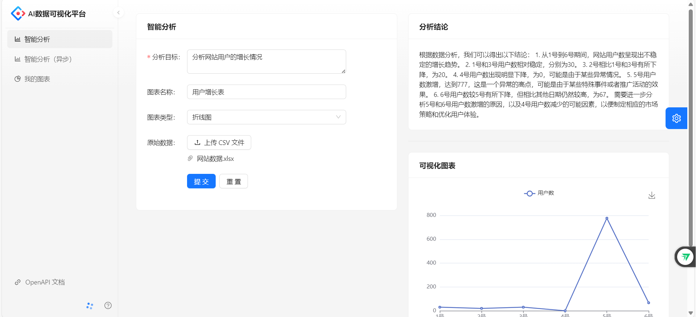
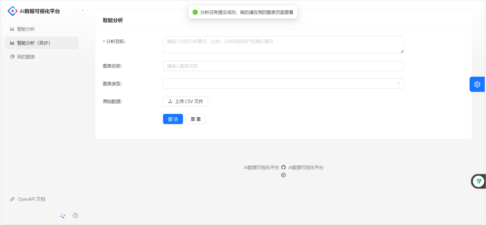
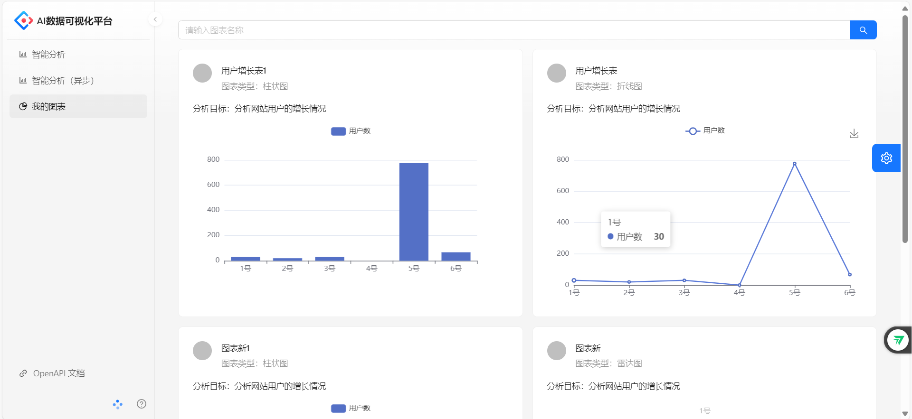

# AI数据可视化平台

基于 Spring Boot + MQ + AIGC（+ React）的智能数据分析平台。区别于传统 BI，用户只需要导入原始数据集、并输入分析诉求，就能自动生成可视化图表及分析结论，实现数据分析的降本增效（或者降低数据分析的人工成本、提高数据分析效率等）。

## 项目功能展示

### 智能分析

-在表单中输入数据后，点击提交按钮，后台自动分析数据，并返回结果。

### 智能分析（异步）

-在表单中输入数据后，点击提交按钮，后台自动分析数据，在结果为生成之前，可多次提交，生成后的结果在我的图表中查看。

### 我的图表

-我的图表是展示历史生成结果

``